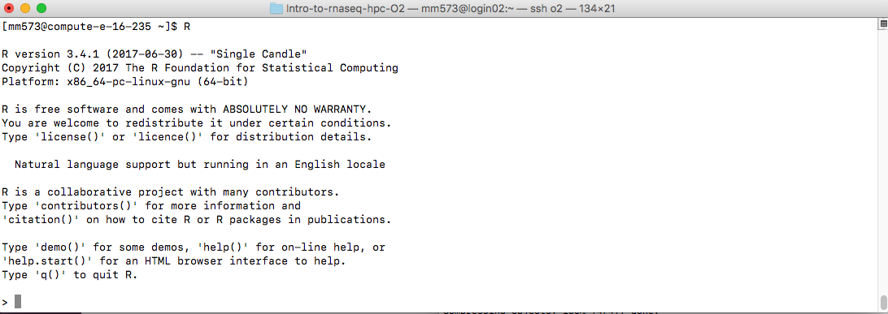

## Learning Objectives:
-------------------

* Run R scripts from the Unix command line
* Use the count matrix as input to an R script for differential expression analysis
* Apply Unix commands to look at the results that are generated and extract relevant information
* Familiarize yourselft with various functional analysis tools for gene lists


## Differential expression analysis
-------------------

At the end of the workflow from the last lesson, our final end product was a count matrix. This is a matrix in which each row represents a gene (or feature) and each column corresponds to a sample. In our dataset, we have two sample classes (control and Mov10oe) and we want to assess the difference in expression between these groups on a gene-by-gene basis.


Intuitively, it would seem that since we know which samples belong to which group we could just compute a fold-change for each gene and then rank genes by that value. Easy, right? Not exactly. The problem is, the gene expression that we are observing is not just a result of the differences between the groups that we are investigating, rather it is a measurement of the sum of many effects. In a given biological sample the transcriptional patterns will also be changing with respect to various extraneous factors; some that we are aware of (i.e demographic factors, batch information) and other noise that we cannot attribute to any particular source. The goal of differential expression analysis to determine the relative role of these effects, and to separate the “interesting” from the “uninteresting”.


### Statistical models in R

[R](https://www.r-project.org/) is a software environment for statistical computing and graphics. R is widely used in the field of bioinformatics, amongst various other disciplines. It can be locally installed on almost all operating systems (and it's free!), with numerous packages available that help in increasing efficency of data handling, data manipulation and data analysis. Discussing the specifics about R is outside the scope of this course. However, we encourage you to take a look at some of the R resources listed below if you are interested in learning more. 

R is a powerful language that can be very useful for NGS data analysis, and there are many popular packages for working with RNA-Seq count data. Some of these packages include [edgeR](https://www.bioconductor.org/packages/release/bioc/vignettes/edgeR/inst/doc/edgeRUsersGuide.pdf), [DESeq2](http://bioconductor.org/packages/release/bioc/vignettes/DESeq2/inst/doc/DESeq2.pdf), and [limma-voom](http://www.genomebiology.com/2014/15/2/R29). All of these tools use statistical modeling of the count data to test each gene against the null hypothesis and evaluate whether or not it is significantly differentially expressed. 


These methods determine, for each gene, whether the differences in expression (counts) **between groups** is significant given the amount of variation observed **within groups** (replicates). To test for significance, we need an appropriate statistical model that accurately performs normalization (to account for differences in sequencing depth, etc.) and variance modeling (to account for few numbers of replicates and large dynamic expression range). The details on how each package works is described thoroughly within each of the respective vignettes.


### Running R scripts

In order to run R on Orchestra, let's first log on to the cluster and start an interactive session with 1 core.

Once you are in an interactive session, navigate to the `rnaseq` directory:

	$ cd ~/unix_workshop/rnaseq

We will be running an R script that uses the R package [DESeq2](http://bioconductor.org/packages/release/bioc/html/DESeq2.html) to identify differentially expressed genes. This package is available from [Bioconductor](https://www.bioconductor.org/), which is a repository of packages for the analysis of high-throughput genomic data. There are also a few other packages that are required to generate some additional figures.

We first need to load the R module:

```bash
$ module load stats/R/3.3.1
```
You can open R by simply typing `R` at the command prompt and pressing `Enter`. You are now in the R console (note that the command prompt has changed to a `>` instead of a `$`):



Rather than installing the packages required for the analysis, we have already done this for you. Packages are bundles of code that perform functions and include detailed documentation on how to use those functions. Once installed, they are referred to as _libraries_.  **To use the libraries we have created for you first exit R with:**

```R
q()
```
You should find yourself back at the shell command prompt. The next few lines will set the environment variable `R_LIBS_USER` to let R know where the R libraries directory resides.

```bash
$ echo 'R_LIBS_USER="/groups/hbctraining/unix_workshop_other/R-3.3.1"' >  $HOME/.Renviron
$ export R_LIBS_USER="/groups/hbctraining/unix_workshop_other/R-3.3.1"
```

To run differential expression analysis, we are going to run a script from the `results` directory, so let's navigate there and create a directory for the results of our analysis. We will call the directory `diffexpression`:

```bash
$ cd ~/unix_workshop/rnaseq/results
$ mkdir diffexpression
```
First, let's copy over the script file:
```bash
$ cp /groups/hbctraining/unix_workshop_other/DESeq2_script.R diffexpression/
```
The DE script will require as input **1) your count matrix file** and **2) a metadata file**. The count matrix we generated in the last lesson and is in the `counts` directory. The metadata file is a tab-delimited file which contains any information associated with our samples. Each row corresponds to a sample and each column contains some information about each sample.

```bash
$ cp ~/unix_workshop/other/Mov10_rnaseq_metadata.txt diffexpression
```
> **NOTE:** If you _didn't generate this file in class_ we have a pre-computed count matrix generated that you can use:
>  
>  `$ cp /groups/hbctraining/unix_workshop_other/counts_STAR/Mov10_rnaseq_counts_complete.txt diffexpression`
> 

Once you have the files copied, take a quick look at the metadata using `less`.

Now we're all setup to run our R script! Let's run it from within our `diffexpression` directory,
```bash
$ cd diffexpression
$ Rscript DESeq2_script.R Mov10_rnaseq_counts_complete.txt Mov10_rnaseq_metadata.txt 
```

> How many files do you get as output from the script? There should be a few PNG files and text files. Use Filezilla or `scp` to copy the images over to your laptop and take a look what was generated. How well do the replicates cluster based on the plots that were generated?


### Gene list exploration

There are two results files generated from `DE_script.R`, a full table and significant genes table (at FDR < 0.05). Take a look at the significant results file and see what values have been reported:

```bash
$ head DEresults_sig_table.txt
```
You should have a table with 7 columns in it:

1. Gene symbols (this will not have a column name, due to the nature of the `write` function)
2. baseMean: the average normalized counts across all samples
3. log2FoldChange
4. lfcse: the standard error of the log2 FC
5. stat: the Wald test statistic
6. pvalue
7. padj: p-value adjusted for multiple test correction using the BH method

Since we have the full table of values we could theoretically use that and filter the genes to our discretion. We could also increase stringency by adding in a fold change criteria. The full table is also useful for investigating genes of interest that did not appear in our significant list, and give us some insight into whether the gene missed the threshold marginally or by a landslide. 

Using `wc -l` find out how many genes are identified in the significant table? Keep in mind this is generated using the truncated dataset.

```bash
$ wc -l DEresults_sig_table.txt
```

For downstream analysis, the relevant information that we will require from this results table is the gene names and the FDR value. We can cut the columns to a new file and and use that as input to some functional analaysis tools.

```bash
$ cut -f1,7 DEresults_sig_table.txt > Mov10_sig_genelist.txt
```

Since the list we have is generated from analaysis on a small subset of chromosome 1, using these genes as input to downstream tools will not provide any meaningful results. As such, **we have generated a list using the full dataset for these samples and can be downloaded to your laptop via [this link](../genelist_edgeR_Mov10oe_1.0FC.txt).** From the full dataset analysis, 453 genes were identified as significant if they had an FDR < 0.05 _and_ a log fold change > 1.  


### Differential expression analysis using pseudocounts 

In the script we used above, we used count data generated from the standard RNA-seq workflow as input. The instructions are below to perform a similar analysis with the output from Salmon. To perform this analysis, you will need to use R and Rstudio directly. We do not have a script available that works on Orchestra. 

**The rest of this section assumes that you are comfortable with R and RStudio.**

The output from Salmon is transcript counts, but DESeq2 works well only with gene counts. To bridge this gap, the developers of DESeq2 have developed a package makes the output of Salmon compatible with DESeq2. This package is called [`tximport`](https://bioconductor.org/packages/release/bioc/html/tximport.html) and is also vailable through Bioconductor. `tximport` imports transcript-level abundance, estimated counts and transcript lengths, and summarizes this into matrices for use with downstream gene-level analysis packages. 

First, you have to download the directory with the quant.sf files for the 8 full datasets using the link below. Once you have them downloaded continue to follow the rest of instructions:

1. [Download Salmon files](https://www.dropbox.com/s/aw170f8zge01jpq/salmon.zip?dl=0)
2. Decompress (unzip) the zip archive and move the folder to an appropriate location (i.e `~/Desktop`)
3. Open RStudio and select 'File' -> 'New Project'  -> 'Existing Directory' and navigate to the `salmon` directory 
4. Open up a new R script ('File' -> 'New File' -> 'Rscript'), and save it as `salmon_de.R`

Your Rstudio interface should look something like the screenshot below:


To perform this analysis you will have to install the following libraries:

`tximport`

`readr`

`DESeq2`

`biomaRt`

**Step 1:** Load the required libraries:

```R
# Load libraries
library(tximport)
library(readr)
library(DESeq2)
library(biomaRt) # tximport requires gene symbols as row names
```

**Step 2:** Load the quantification data that was output from Salmon:

```R
## List all directories containing data  
samples <- list.files(path = ".", full.names = F, pattern="\\.salmon$")
    
## Obtain a vector of all filenames including the path
files <- file.path(samples, "quant.sf")
    
## Since all quant files have the same name it is useful to have names for each element
names(files) <-  samples
```

The **main objective here is to add names to our quant files which will allow us to easily discriminate between samples in the final output matrix**. 

**Step 3.** Create a dataframe containing Ensembl Transcript IDs and Gene symbols

Our Salmon index was generated with transcript sequences listed by Ensembl IDs, but `tximport` needs to know **which genes these transcripts came from**, so we need to use the `biomaRt` package to extract this information. 

> *NOTE:* Keep in mind that the Ensembl IDs listed in our Salmon output contained version numbers (i.e ENST00000632684.1). If we query Biomart with those IDs it will not return anything. Therefore, before querying Biomart in R do not forget to strip the version numbers from the Ensembl IDs.

```R
## DO NOT RUN

# Create a character vector of Ensembl IDs		
ids <- read.delim(files[1], sep="\t", header=T)    # extract the transcript ids from one of the files
ids <- as.character(ids[,1])
require(stringr)
ids.strip <- str_replace(ids, "([.][0-9])", "")

# Create a mart object
# Note that we are using an archived host, since "www.ensembl.org" gave us an error
mart <- useDataset("hsapiens_gene_ensembl", useMart("ENSEMBL_MART_ENSEMBL", host="mar2016.archive.ensembl.org"))

# Get official gene symbol and Ensembl gene IDs
tx2gene <- getBM(
    filters= "ensembl_transcript_id", 
     attributes= c("ensembl_transcript_id", "external_gene_name"),
     values= ids.strip,
     mart= mart)
     
```

**We have already run the above code for you and saved the output in a text file which is in the salmon directory.** Load it in using: 

```R
tx2gene <- read.delim("tx2gene.txt",sep="\t")
```
    
**Step 4:** Run tximport to summarize gene-level information    
```R
?tximport   # let's take a look at the arguments for the tximport function

txi <- tximport(files, type="salmon", txIn = TRUE, txOut = FALSE, tx2gene=tx2gene, reader=read_tsv, ignoreTxVersion=TRUE)
```
### Output from `tximport`

The `txi` object is a simple list with three matrices: abundance, counts, length. 
```R
attributes(txi)
```
A final element 'countsFromAbundance' carries through the character argument used in the tximport call. The length matrix contains the average transcript length for each gene which can be used as an offset for gene-level analysis. 

### Using DESeq2 for DE analysis with pseudocounts

```R    
## Create a sampletable/metadata

# Before we create this metadata object, let's see what the sample (column) order of the counts matrix is:
colnames(txi$counts)

condition=factor(c(rep("Ctl",3), rep("KD", 2), rep("OE", 3)))
sampleTable <- data.frame(condition, row.names = colnames(txi$counts))

## Create a DESeqDataSet object
dds <- DESeqDataSetFromTximport(txi, sampleTable, ~ condition)
```

Now you have created a DESeq object to proceed with DE analysis you can now complete the DE analysis using methods in the script we ran
for the counts from STAR. 

### Resources for R

* https://www.datacamp.com/courses/free-introduction-to-r
* Software Carpentry materials: http://swcarpentry.github.io/r-novice-inflammation/
* Data Carpentry materials: http://tracykteal.github.io/R-genomics/
* Materials from IQSS at Harvard: http://tutorials.iq.harvard.edu/R/Rintro/Rintro.html
* [swirl](http://swirlstats.com/): learn R interactively from within the R console
* The free "try R" class from [Code School](http://tryr.codeschool.com)
* HarvardX course ["Statistics and R for the Life Sciences"](https://courses.edx.org/courses/HarvardX/PH525.1x/1T2015/info)

***
*This lesson has been developed by members of the teaching team at the [Harvard Chan Bioinformatics Core (HBC)](http://bioinformatics.sph.harvard.edu/). These are open access materials distributed under the terms of the [Creative Commons Attribution license](https://creativecommons.org/licenses/by/4.0/) (CC BY 4.0), which permits unrestricted use, distribution, and reproduction in any medium, provided the original author and source are credited.*

