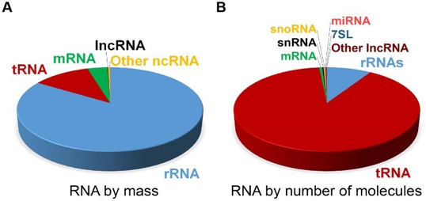
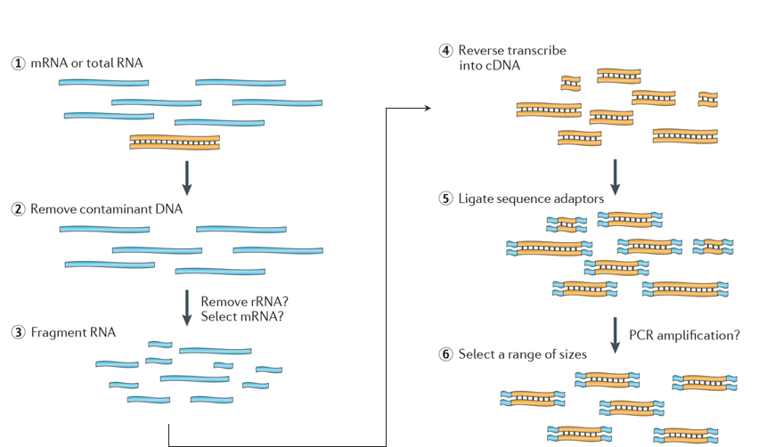
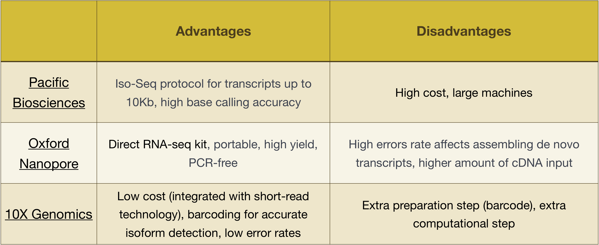
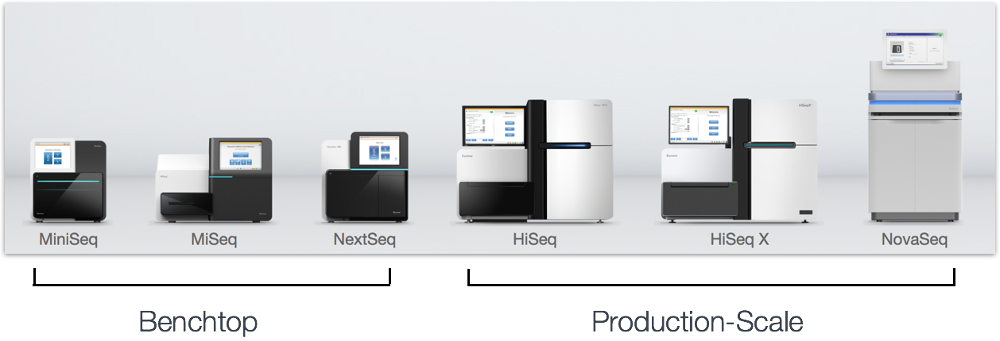
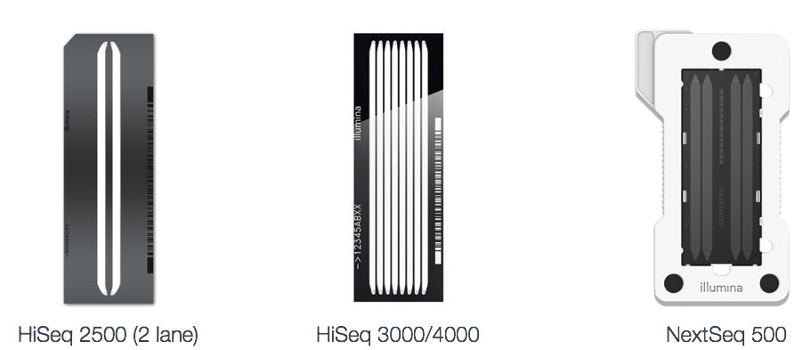
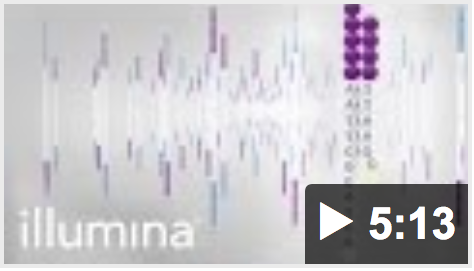
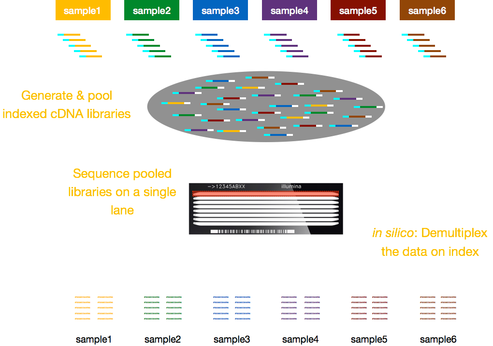

Approximate time: 90 minutes

## Learning Objectives:

* Describe the process of RNA-seq library preparation
* Describe Illumina sequencing method
* Discuss special considerations for experimental design

# Experimental steps and considerations

## Introduction to RNA-seq

RNA-seq is an exciting experimental technique that is utilized to explore and/or quantify gene expression within or between conditions. 

As we know, genes provide instructions to make proteins, which perform some function within the cell. Although all cells contain the same DNA sequence, muscle cells are different from nerve cells and other types of cells because of the different genes that are turned on in these cells and the different RNAs and proteins produced. 

 

Different biological processes, as well as mutations, can affect which genes are turned on and which are turned off, in addition to, *how much* specific genes are turned on/off.

To make proteins, the DNA is transcribed into messenger RNA, or mRNA, which is translated by the ribosome into protein. However, some genes encode RNA that does not get translated into protein; these RNAs are called non-coding RNAs, or ncRNAs. Often these RNAs have a function in and of themselves and include rRNAs, tRNAs, and siRNAs, among others. All RNAs transcribed from genes are called transcripts.

 

To be translated into proteins, mRNA must undergo processing. In the figure below, the top strand in the image represents a gene in the DNA, comprised of the untranslated regions (UTRs) and the open read frame. Genes are transcribed into pre-mRNA, which still contains the intronic sequences.  After post-transciptional processing, the introns are spliced out and a polyA tail and 5' cap are added to yield mature mRNA transcripts, which can be translated into proteins.

 

**While mRNA transcripts have a polyA tail, many of the non-coding RNA transcripts do not as the post-transcriptional processing is different for these transcripts.**

RNA-seq data can be used to explore and/or quantify the RNA transcripts, which can be utilized for the following types of experiments:

- Differential Gene Expression: *quantitative* evaluation and comparison of transcript levels
- Transcriptome assembly: building the profile of transcribed regions of the genome, a *qualitative* evaluation. 
- Can be used to help build better gene models, and verify them using the assembly
- Metatranscriptomics or community transcriptome analysis

## Illumina library preparation

When starting an RNA-seq experiment, for every sample the RNA needs to be isolated and turned into a cDNA library for sequencing. Generally, ribosomal RNA represents the majority of the RNAs present in a cell, while messenger RNAs represent a small percentage of total RNA, ~2% in humans.

 

Therefore, if we want to study the protein-coding genes, we need to enrich for mRNA or deplete the rRNA. **For differential gene expression analysis, it is best to enrich for Poly(A)+, unless you are aiming to obtain information about long non-coding RNAs, then do a ribosomal RNA depletion.**

The workflow for library preparation is detailed in the image below:

 
 
 *Image credit: [Martin J.A. and Wang Z., Nat. Rev. Genet. (2011) 12:671–682](https://www.nature.com/articles/nrg3068)*

Briefly, the RNA is isolated from the sample and contaminating DNA is removed, followed by either selection of the mRNA or depletion of the rRNA. The resulting RNA is fragmented then reverse transcribed into cDNA. Sequence adapters are added to the ends of the fragments and the fragments are PCR amplified if needed. Finally, the fragments are size selected (usually ~300-500bp) to finish the library.

The cDNA libraries can be generated in a way to retain information about which strand of DNA the RNA was transcribed from. Libraries that retain this information are called stranded libraries, which are now standard with Illumina’s TruSeq stranded RNA-Seq kits. Stranded libraries should not be any more expensive than unstranded, so there is not really any reason not to acquire this additional information. 

There are 3 types of cDNA libraries available:

- Forward (secondstrand) – reads resemble the gene sequence or the secondstrand cDNA sequence
- Reverse (firststrand)– reads resemble the complementary gene sequence or firststrand cDNA sequence (TruSeq)
- Unstranded 

> **NOTE:** This workflow is specific to Illumina sequencing, which is currently the most utilized sequencing method. But there are other long-read methods worth noting, such as:
>
> - Pacific Biosciences: http://www.pacb.com/ 
> - Oxford Nanopore (MinION): https://nanoporetech.com/ 
> - 10X Genomics: https://www.10xgenomics.com/ 
> 
> Advantages and disadvantages of these technologies can be explored in the table below:
>
> 

## Illumina Sequencing

After preparation of the libraries, sequencing can be performed to generate the nucleotide sequences of the ends of the fragments, which are called **reads**. You will have the choice of sequencing a single end of the cDNA fragments (single-end reads) or both ends of the fragments (paired-end reads).

- SE - Single end dataset => Only Read1
- PE - Paired-end dataset => Read1 + Read2
	- can be 2 separate FastQ files or just one with interleaved pairs

Generally single-end sequencing is sufficient unless it is expected that the reads will match multiple locations on the genome (e.g. organisms with many paralogous genes), assemblies are being performed, or for splice isoform differentiation. Be aware that paired-end reads are generally 2x more expensive.

There are a variety of Illumina platforms to choose from to sequence the cDNA libraries.

 *Image credit: Adapted from [Illumina](www.illumina.com)*

Differences in platform can alter the length of reads generated as well as the total number of reads sequenced per run and the amount of time required to sequence the libraries. The different platforms each use a different flow cell, which is a glass surface coated with an arrangement of paired oligos that are complementary to the adapters added to your template molecules. The flow cell is where the sequencing reactions take place.

 *Image credit: Adapted from [Illumina](www.illumina.com)*
 

Let's explore how Illumina sequencing is performed:

- Number of clusters ~= Number of reads
- Number of sequencing cycles = Length of reads

The number of cycles (length of the reads) will depend on sequencing platform used as well as your preferences.

Charges for sequencing are usually per lane of the flow cell, and usually you don’t need one lane per sample. Multiplexing allows you to sequence multiple samples per lane with addition of indices (within the Illumina adapter) or special barcodes (outside the Illumina adapter).

## Experimental planning considerations

Understanding the steps in the experimental process of RNA extraction and preparation of RNA-Seq libraries is helpful for designing an RNA-Seq experiment, but there are special considerations that should be highlighted that can greatly affect the quality of a differential expression analysis. 

These important considerations include:

1. Number and type of **replicates**
2. Avoiding **confounding**
3. Addressing **batch effects**

We will go over each of these considerations in detail, discussing best practice and optimal design.

## Replicates

Experimental replicates can be performed as **technical replicates** or **biological replicates**. 

*Image credit: [Klaus B., EMBO J (2015) **34**: 2727-2730](https://dx.doi.org/10.15252%2Fembj.201592958)*

- **Technical replicates:** use the same biological sample to repeat the technical or experimental steps in order to accurately measure technical variation and remove it during analysis. 

- **Biological replicates** use different biological samples of the same condition to measure the biological variation between samples. 

For mice or rats, this might be easy to determine what constitutes a different biological sample, but it's a bit more difficult to determine for cell lines. When using cell lines it's best to include as much variation between samples as possible, and [this article](http://paasp.net/accurate-design-of-in-vitro-experiments-why-does-it-matter/) gives some great recommendations for cell line replicates.

In the days of microarrays, technical replicates were considered a necessity; however, with the current RNA-Seq technologies, technical variation is much lower than biological variation and **technical replicates are unneccessary**.

In contrast, **biological replicates are absolutely essential**. For differential expression analysis, the more biological replicates, the better the estimates of biological variation and the more precise our estimates of the mean expression levels. This leads to more accurate modeling of our data and identification of more differentially expressed genes.

*Image credit: [Liu, Y., et al., Bioinformatics (2014) **30**(3): 301–304](https://doi.org/10.1093/bioinformatics/btt688)*

As the figure above illustrates, **biological replicates are of greater importance than sequencing depth**, which is the total number of reads sequenced per sample. The figure shows the relationship between sequencing depth and number of replicates on the number of differentially expressed genes identified [[1](https://academic.oup.com/bioinformatics/article/30/3/301/228651/RNA-seq-differential-expression-studies-more)]. Note that an **increase in the number of replicates tends to return more DE genes than increasing the sequencing depth**. Therefore, generally more replicates are better than higher sequencing depth, with the caveat that higher depth is required for detection of lowly expressed DE genes and for performing isoform-level differential expression. 

Replicates are almost always preferred to greater sequencing depth for bulk RNA-Seq. However, **guidelines depend on the experiment performed and the desired analysis**. Below we list some general guidelines for replicates and sequencing depth to help with experimental planning:

- **General gene-level differential expression:**

  - ENCODE guidelines suggest 30 million SE reads per sample (stranded).
  
  - 15 million reads per sample is often sufficient, if there are a good number of replicates (>3). 

  - Spend money on more biological replicates, if possible.

- **Gene-level differential expression with detection of lowly-expressed genes:**
  
  - Similarly benefits from replicates more than sequencing depth.

  - Sequence deeper with at least 30-60 million reads depending on level of expression (start with 30 million with a good number of replicates). 
  
- **Isoform-level differential expression:**

  - Of known isoforms, suggested to have a depth of at least 30 million reads per sample and paired-end reads.

  - OF novel isoforms should have more depth (> 60 million reads per sample).

  - Choose biological replicates over paired/deeper sequencing.

  - Perform careful QC of RNA quality. Be careful to use high quality preparation methods and restrict analysis to high quality RIN # samples.  
  
- **Other types of RNA analyses (intron retention, small RNA-Seq, etc.):** 
  
  - Different recommendations depending on the analysis.
  
  - Almost always more biological replicates are better!
  
> **NOTE:** The factor used to estimate the depth of sequencing for genomes is "coverage" - how many times do the number nucleotides sequenced "cover" the genome. This metric is not exact for genomes, but it works okay. It **does not work for transcriptomes** because expression of the genes depend on the condition being studied.

## Confounding
  
A confounded RNA-Seq experiment is one where you **cannot distinguish the separate effects of two different sources of variation** in the data. 

For example, we know that sex has large effects on gene expression, and if all of our *control* mice were female and all of the *treatment* mice were male, then our treatment effect would be confounded by sex. **We could not differentiate the effect of treatment from the effect of sex.**

  

**To AVOID confounding:**

- Ensure animals in each condition are all the **same sex, age, litter, and batch**, if possible.

- If not possible, then ensure to split the animals equally between conditions

  

## Batch effects

Batch effects are a significant issue for RNA-Seq analyses, since you can see significant differences in expression due solely to the batch effect. 

*Image credit: [Hicks SC, et al., bioRxiv (2015)](https://www.biorxiv.org/content/early/2015/08/25/025528)*

To explore the issues generated by poor batch study design, they are highlighted nicely in [this paper](https://f1000research.com/articles/4-121/v1).

### How to know whether you have batches?

- Were all RNA isolations performed on the same day?

- Were all library preparations performed on the same day?

- Did the same person perform the RNA isolation/library preparation for all samples?

- Did you use the same reagents for all samples?

- Did you perform the RNA isolation/library preparation in the same location?

If *any* of the answers is **‘No’**, then you have batches.

### Best practices regarding batches:

- Design the experiment in a way to **avoid batches**, if possible.

- If unable to avoid batches:

  - **Do NOT confound** your experiment by batch:

    
    
    *Image credit: [Hicks SC, et al., bioRxiv (2015)](https://www.biorxiv.org/content/early/2015/08/25/025528)*
  
  - **DO** split replicates of the different sample groups across batches. The more replicates the better (definitely more than 2).
  
    

    *Image credit: [Hicks SC, et al., bioRxiv (2015)](https://www.biorxiv.org/content/early/2015/08/25/025528)*
    
  - **DO** include batch information in your **experimental metadata**. During the analysis, we can regress out the variation due to batch so it doesn’t affect our results if we have that information.

    
    
 ***
 **Exercise**
 
Your experiment has three different treatment groups, A, B, and C. Due to the lengthy process of tissue extraction, you can only isolate the RNA from two samples at the same time. You plan to have 4 replicates per group.

1. Fill in the `RNA isolation` column of the metadata table. Since we can only prepare 2 samples at a time and we have 12 samples total, you will need to isolate RNA in 6 batches. In the `RNA isolation` column, enter one of the following values for each sample: `group1`, `group2`, `group3`, `group4`, `group5`, `group6`. Make sure to fill in the table so as to avoid confounding by batch of `RNA isolation`. 

2. **BONUS:** To perform the RNA isolations more quickly, you devote two researchers to perform the RNA isolations. Fill in their initials to the `researcher` column for the samples they will prepare: use initials `AB` or `CD`.

  | sample | treatment | sex | replicate | RNA isolation |
  | --- | --- | --- | --- | --- |
  | sample1 | A | F | 1 | 
  | sample2 | A | F | 2 |
  | sample3 | A | M | 3 |
  | sample4 | A | M | 4 |
  | sample5 | B | F | 1 |
  | sample6 | B | F | 2 |
  | sample7 | B | M | 3 |
  | sample8 | B | M | 4 |
  | sample9 | C | F | 1 |
  | sample10 | C | F | 2 |
  | sample11 | C | M | 3 |
  | sample12 | C | M | 4 |

***    
